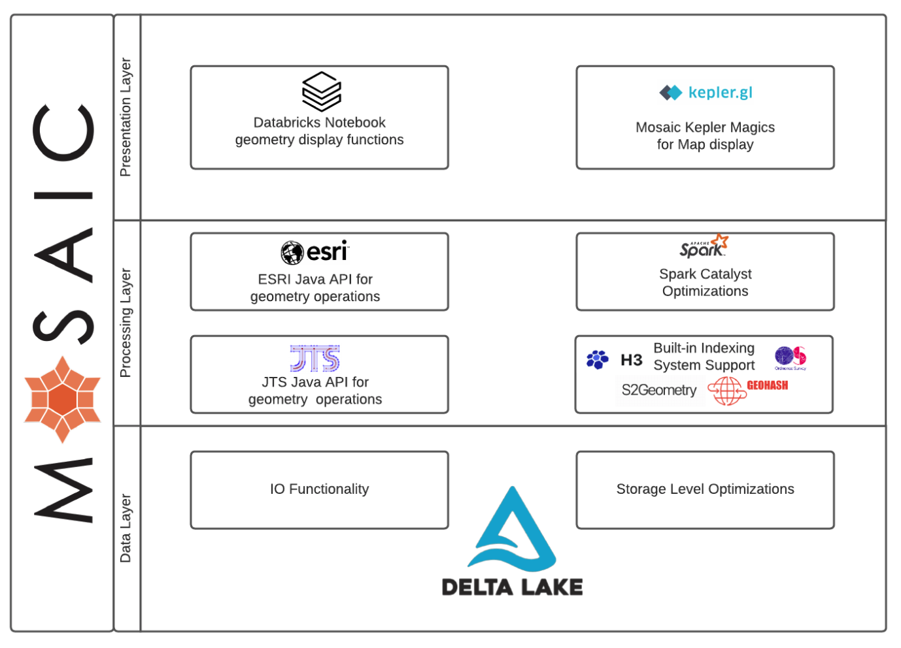
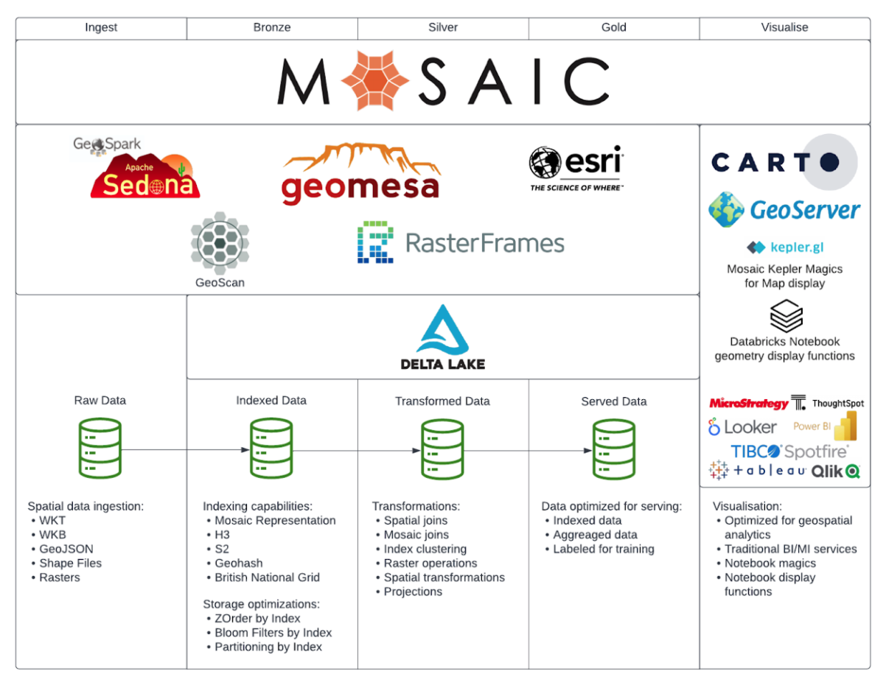

# Mosaic by Databricks Labs


An extension to the [Apache Spark](https://spark.apache.org/) framework that allows easy and fast processing of very large geospatial datasets.

[](https://badge.fury.io/py/databricks-mosaic)

[](https://codecov.io/gh/databrickslabs/mosaic)
[](https://github.com/databrickslabs/mosaic/actions?query=workflow%3A%22build+main%22)
[](https://github.com/databrickslabs/mosaic/actions/workflows/docs.yml)
[](https://lgtm.com/projects/g/databrickslabs/mosaic/context:python)
[](https://github.com/psf/black)


## Why Mosaic?

Mosaic was created to simplify the implementation of scalable geospatial data pipelines by bounding together common Open Source geospatial libraries via Apache Spark, with a set of [examples and best practices](#examples) for common geospatial use cases.


## What does it provide?
Mosaic provides geospatial tools for
* Data ingestion (WKT, WKB, GeoJSON)
* Data processing
    * Geometry and geography `ST_` operations (with default [JTS](https://github.com/locationtech/jts) or [ESRI](https://github.com/Esri/geometry-api-java)) 
    * Indexing (with default [H3](https://github.com/uber/h3) or BNG)
    * Chipping of polygons and lines over an indexing grid [co-developed with Ordnance Survey and Microsoft](https://databricks.com/blog/2021/10/11/efficient-point-in-polygon-joins-via-pyspark-and-bng-geospatial-indexing.html)
* Data visualization ([Kepler](https://github.com/keplergl/kepler.gl))


The supported languages are Scala, Python, R, and SQL.

## How does it work?

The Mosaic library is written in Scala to guarantee maximum performance with Spark and when possible, it uses code generation to give an extra performance boost.

The other supported languages (Python, R and SQL) are thin wrappers around the Scala code.



Image1: Mosaic logical design.

## Getting started

We recommend using Databricks Runtime versions 11.3 LTS or 12.2 LTS with Photon enabled; this will leverage the 
Databricks H3 expressions when using H3 grid system. 

:warning: **Mosaic 0.3 series does not support DBR 13** (coming soon); also, DBR 10 is no longer supported in Mosaic. 

As of the 0.3.11 release, Mosaic issues the following warning when initialized on a cluster that is neither Photon Runtime nor Databricks Runtime ML [[ADB](https://learn.microsoft.com/en-us/azure/databricks/runtime/) | [AWS](https://docs.databricks.com/runtime/index.html) | [GCP](https://docs.gcp.databricks.com/runtime/index.html)]:

> DEPRECATION WARNING: Mosaic is not supported on the selected Databricks Runtime. Mosaic will stop working on this cluster after v0.3.x. Please use a Databricks Photon-enabled Runtime (for performance benefits) or Runtime ML (for spatial AI benefits).

If you are receiving this warning in v0.3.11+, you will want to begin to plan for a supported runtime. The reason we are making this change is that we are streamlining Mosaic internals to be more aligned with future product APIs which are powered by Photon. Along this direction of change, Mosaic will be standardizing to JTS as its default and supported Vector Geometry Provider.

### Documentation

Check out the [documentation pages](https://databrickslabs.github.io/mosaic/).

### Python

Install [databricks-mosaic](https://pypi.org/project/databricks-mosaic/)
as a [cluster library](https://docs.databricks.com/libraries/cluster-libraries.html), or run from a Databricks notebook

```shell
%pip install databricks-mosaic
```

Then enable it with

```python
from mosaic import enable_mosaic
enable_mosaic(spark, dbutils)
```

### Scala
Get the jar from the [releases](https://github.com/databrickslabs/mosaic/releases) page and install it as a [cluster library](https://docs.databricks.com/libraries/cluster-libraries.html).

Then enable it with

```scala
import com.databricks.labs.mosaic.functions.MosaicContext
import com.databricks.labs.mosaic.H3
import com.databricks.labs.mosaic.JTS

val mosaicContext = MosaicContext.build(H3, JTS)
import mosaicContext.functions._
```

### R
Get the Scala JAR and the R from the [releases](https://github.com/databrickslabs/mosaic/releases) page. Install the JAR as a [cluster library](https://docs.databricks.com/libraries/cluster-libraries.html), and copy the `sparkrMosaic.tar.gz` to DBFS (This example uses `/FileStore` location, but you can put it anywhere on DBFS).

```R
library(SparkR)

install.packages('/FileStore/sparkrMosaic.tar.gz', repos=NULL)
```

Enable the R bindings
```R
library(sparkrMosaic)
enableMosaic()
```

### SQL
Configure the [Automatic SQL Registration](https://databrickslabs.github.io/mosaic/usage/automatic-sql-registration.html) _or_ follow the Scala installation process and register the Mosaic SQL functions in your SparkSession from a Scala notebook cell:

```scala
%scala
import com.databricks.labs.mosaic.functions.MosaicContext
import com.databricks.labs.mosaic.H3
import com.databricks.labs.mosaic.JTS

val mosaicContext = MosaicContext.build(H3, JTS)
mosaicContext.register(spark)
```


## Examples

| Example | Description | Links |
| --- | --- | --- |
| __Quick Start__ | Example of performing spatial point-in-polygon joins on the NYC Taxi dataset | [python](/notebooks/examples/python/QuickstartNotebook.py), [scala](notebooks/examples/scala/QuickstartNotebook.scala), [R](notebooks/examples/R/QuickstartNotebook.r), [SQL](notebooks/examples/sql/QuickstartNotebook.sql) | 
| Spatial KNN | Runnable notebook-based example using Mosaic [SpatialKNN](https://databrickslabs.github.io/mosaic/models/spatial-knn.html) model | [python](notebooks/examples/python/SpatialKNN) |
| Open Street Maps | Ingesting and processing with Delta Live Tables the Open Street Maps dataset to extract buildings polygons and calculate aggregation statistics over H3 indexes | [python](notebooks/examples/python/OpenStreetMaps) |
| STS Transfers | Detecting Ship-to-Ship transfers at scale by leveraging Mosaic to process AIS data. | [python](notebooks/examples/python/Ship2ShipTransfers), [blog](https://medium.com/@timo.roest/ship-to-ship-transfer-detection-b370dd9d43e8) |

You can import those examples in Databricks workspace using [these instructions](https://docs.databricks.com/notebooks/notebooks-manage.html#import-a-notebook).

## Ecosystem
Mosaic is intended to augment the existing system and unlock the potential by integrating spark, delta and 3rd party frameworks into the Lakehouse architecture.


Image2: Mosaic ecosystem - Lakehouse integration.

### Project Support
Please note that all projects in the `databrickslabs` github space are provided for your exploration only, and are not formally supported by Databricks with Service Level Agreements (SLAs). They are provided AS-IS and we do not make any guarantees of any kind. Please do not submit a support ticket relating to any issues arising from the use of these projects.

Any issues discovered through the use of this project should be filed as GitHub Issues on the Repo. They will be reviewed as time permits, but there are no formal SLAs for support.
